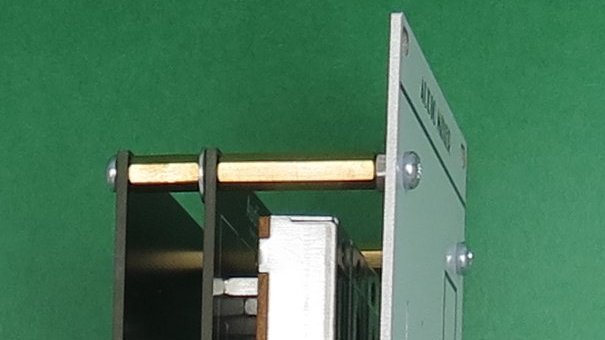

# Analog Output Audio Mixer build notes

## Pots and jacks

To build the pots and jacks board, first position the slide pots on the board, then lay the front panel on top; turn over and solder the pots in place.

Then remove the front panel. Add spacers to the front panel (see below). Position jacks on the board, then put the front panel over the jacks. Loosely secure the jacks with their nuts and washers, and secure the spacers to the PCB, then solder the jacks in place.

## Screws and spacers

Screws and spacers may depend on your choice of jacks and pin headers/sockets, and thickness of panel and PCBs. I used 4 each of:

* 12 mm screw (Tayda A-1253)
* Nut (Tayda A-1247)
* 20 mm male-female spacer (Tayda A-1284)
* Washer (Tayda A-1248)
* 10 mm female-female spacer (Tayda A-1232)
* 6 mm screw (Tayda A-1250)

(All M3.)

12 mm screw through front panel, nut behind panel, 20 mm spacer on screw, pot/jack PCB on spacer; washer behind PCB, 10 mm spacer on 20 mm spacer, main PCB on spacer secured with 6 mm screw.

The bottom two holes in the panel are rather superfluous and could just be left empty or filled with a short screw and nut. Then just secure a spacer between the two PCBs.

