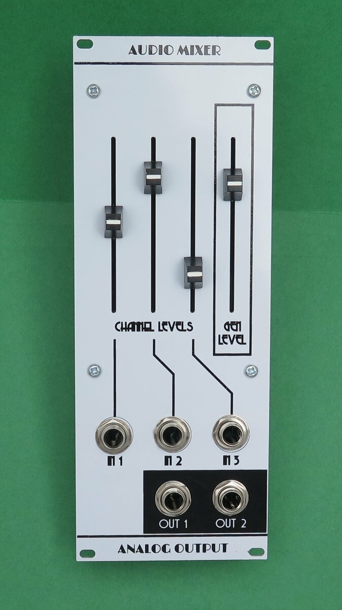
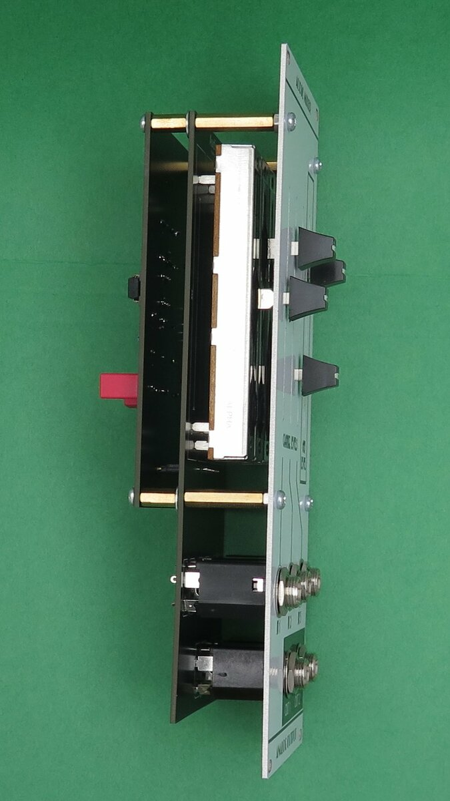
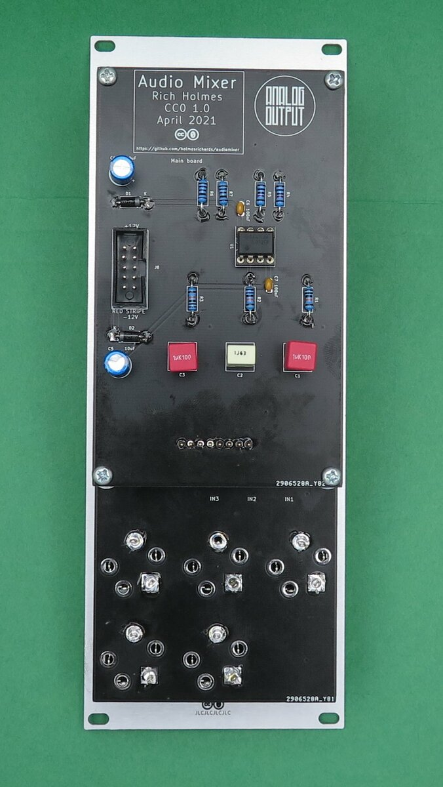

# Analog Output Audio Mixer

This is an audio mixer synth module in Kosmo format. It has three inputs, each with a slide attenuator, and a general level control and two identical outputs.

## Photos





## Documentation:

* [Schematic](Docs/ao_audio_mixer.pdf)
* [PCB layout](Docs/ao_audio_mixer_layout.pdf)
* [BOM](Docs/ao_audio_mixer_bom.md)
* [Build notes](Docs/build.md)

## GitHub repository

* [https://github.com/holmesrichards/audiomixer](

## Submodules

This repo uses submodules aoKicad and Kosmo_panel, which provide needed libaries for KiCad. To clone:

```
git clone git@github.com:holmesrichards/audiomixer.git
git submodule init
git submodule update
```

Alternatively do

```
git clone --recurse-submodules git@github.com:holmesrichards/audiomixer.git
```

Or if you download the repository as a zip file, you must also click on the "aoKicad" and "Kosmo\_panel" links on the GitHub page (they'll have "@ something" after them) and download them as separate zip files which you can unzip into this repo's aoKicad and Kosmo\_panel directories.

If desired, copy the files from aoKicad and Kosmo\_panel to wherever you prefer (your KiCad user library directory, for instance, if you have one). Then in KiCad, add symbol libraries 

```
aoKicad/ao_symbols
Kosmo_panel/Kosmo
```
and footprint libraries 
```
aoKicad/ao_tht
Kosmo_panel/Kosmo_panel.
```
